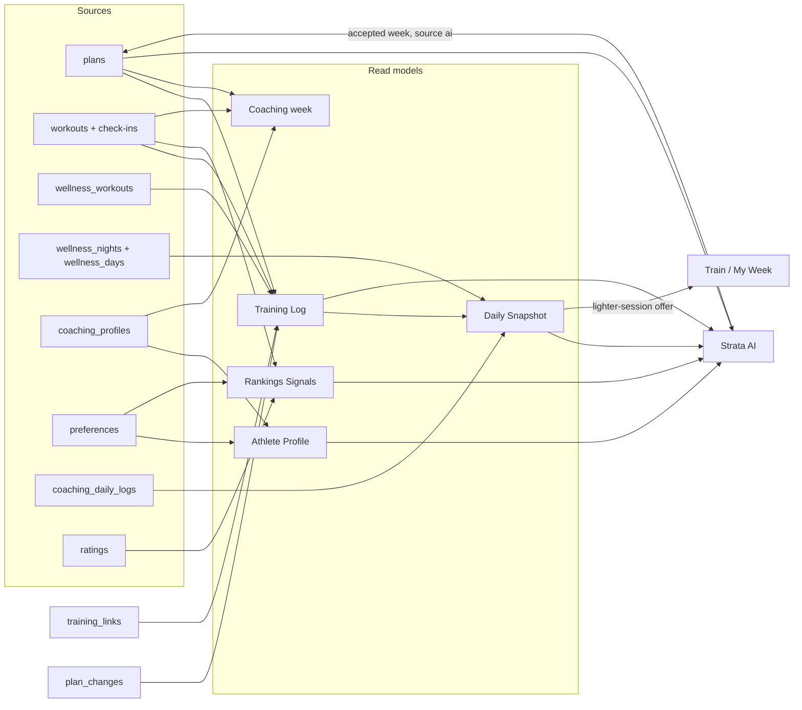

# STRATA data model (Build 9)

One owner per fact. Every screen and every API reads a fact from its owner, through the
read model named here, and writes it back through the same route. When two stored records
must agree, a listener on the event bus keeps them in step; no route updates another feature's
table. `src/data-service.js` is the front door for the shared read models: routes and
Strata AI read through it instead of querying tables.

## Read models

| Read model | Route | Composed from | Who reads it |
|---|---|---|---|
| **Account** | `GET /api/me` | `users`, `sessions`, billing (`paddle_purchases`, `paddle_subscriptions`, `admin_account_controls`), `plans` stats | Every page header, entitlement checks (`capabilities`) |
| **Athlete Profile** | `GET /api/profile` | `preferences` (ranking lens) + `coaching_profiles` (training, body, energy, schedule, food) | Rankings "Personal match", Library, Plan, Nutrition, Strata AI context |
| **Weekly plan** | `GET /api/plan`, `PUT /api/plan` | `plans.plan_json`, with each save's source in `plan_changes` | Planner, studio Overview and Plan, Train, Monthly schedule, coaching, Strata AI |
| **Training Log** | `GET /api/training-log?from&to` (Strata+, up to 92 days) | `workouts` (summaries), `wellness_workouts`, `training_links`, this week's `plans` days, the latest `plan_changes` source | Daily Snapshot, Strata AI context, Progress |
| **Daily Snapshot** | `GET /api/snapshots?from&to` (Strata+, up to 31 days) | `daily_snapshots` rows built from `wellness_nights`, `wellness_days`, `coaching_daily_logs`, and the Training Log | Overview, Recovery, Strata AI context and the Daily Brief |
| **Rankings Signals** | `dataService.rankingsSignals(userId)` | `preferences` (lens), `ratings`, completed exercises in the last 8 weeks | Strata AI context; recommendations read the same history client-side |
| **Coaching week** | `GET /api/coaching/week` | `coaching_weeks.snapshot_json`, built from the weekly plan, the Athlete Profile, and the training log | Plan view ("Your week · with coaching targets"), nutrition targets, diary, meal ideas, Strata AI nutrition preview |
| **Recovery** | `GET /api/devices/polar/…` | `device_connections`, `wellness_nights`, `wellness_days`, `wellness_workouts` | Recovery view, Overview card |

### Training Log entries

Every entry has the same shape whatever its source: `id`, `kind` (`workout`, `device_session`,
`planned`), `source` (`manual`, `polar`, `ai`, `system`), `status` (`completed`, `active`,
`planned`, `not_logged`), `date`, `title`, `startedAt`, `completedAt`, `durationSeconds`,
`exerciseCount`, `completedSets`, `totalSets`, `planDay`, and `device` (the Polar session's
sport, duration, calories, heart rate, and cardio load, when one is linked).

- Workouts logged in Train are `manual`. Polar sessions are `polar`. Planned days carry the
  source of the week's latest save: `manual` (the member's edit), `ai` (an accepted Strata AI
  week), or `system` (setup or an approved plan adjustment).
- **Dedupe.** A Polar session links to the completed workout whose logged time overlaps it most.
  A gym-type session that overlaps nothing links to the day's only completed workout when it is
  also the day's only session. Each side links at most once. Links are stored in
  `training_links` and rewritten only when they change.
- **Planned days.** Only the current week is projected from the saved plan; earlier weeks have
  no stored plan, so they show what was done, never a guessed plan. A gym-type Polar session
  on a planned day with nothing logged completes that day.

### Daily Snapshot fields

One row per member per day: `sleep` (score, stages, times), `recovery` (Nightly Recharge
status, ANS charge, sleep charge, stress level against the member's usual nights), `heart`
(overnight average, HRV, breathing, and the day's resting, min, average, max), `activity`
(null until Polar daily activity is imported), `training` (`status`: `done`, `extra`,
`planned`, `not_logged`, `rest`, or `untracked` for days before this week; the planned
exercises and sets; what was done; cardio load), `nutrition` (the diary entry), `sources`, and
the Strata AI Daily Brief stored next to it (`brief`, `briefGeneratedAt`). Missing data stays
null; nothing is estimated. Rows older than 400 days are deleted with the Polar data they came
from.

## Field owners

| Fact | Owner | Mirror | Rule |
|---|---|---|---|
| Training goal, experience, equipment, movement limitations | `coaching_profiles` when it exists, else `preferences` | `preferences` ↔ `coaching_profiles` | Saving either side mirrors into the other (`src/athlete-profile.js`). The mirror write is an ordinary revision bump, so a stale client gets a conflict instead of a silent overwrite. |
| Days per week | `coaching_profiles.workoutDays` (named days) | `preferences.days` (count) | Count follows the named days; the count never invents day names. |
| Session minutes, usual lifts, time zone | `coaching_profiles` | — | Strata+ only. |
| Exercise preferences (stable, compound, …) | `preferences` | — | Ranking lens only; coaching never reads them. |
| Body, energy, calorie pattern, food | `coaching_profiles` | `coaching_weeks.inputs` (frozen per week) | A week snapshot keeps the inputs it was built from; the live values are in the profile. |
| Weekly plan | `plans` | `monthly_plans` (dated expansion), `coaching_weeks.snapshot_json.training` (read view) | Coaching reads its training sessions from `plans`: same days, exercises, sets, and reps, with rest and history-based targets added. A changed plan (by content fingerprint) regenerates the stored week on the next read; the coaching profile is never edited. Only a member with no training days saved gets a generated starter week, which they can review and save as their plan. |
| Where a week came from | `plan_changes` | Training Log `source` | Written by a `plan.updated` listener: `manual` for the member's edits, `ai` when the chat saves a proposed week, `system` for setup and approved adjustments. Clients may only claim `manual` or `ai`. The newest 50 changes per member are kept. |
| Completed sets | `workouts.workout_json` | `workouts.summary_json`, `started_at` | Derived columns are a read cache written in the same statement. |
| Polar nights, days, sessions | `wellness_*` | `daily_snapshots` (per day), `training_links` | Imported by `devices-sync.js`. Disconnecting Polar deletes its rows, its links, and the member's snapshots (which are rebuilt from what remains). |
| Entitlement | `paddle_purchases` + `paddle_subscriptions` + `admin_account_controls` | `/api/me.capabilities` | Decided once in `billing.hasCurrentAccess`; every route asks `requireFeature`, every page asks `StrataEntitlements.can`. |

## Events (`src/events.js`)

| Event | Emitted by | Payload | Listeners today |
|---|---|---|---|
| `plan.updated` | `PUT /api/plan`, `PUT /api/setup`, approved plan adjustments | `userId`, `plan`, `updatedAt`, `source`, `detail` | Plan history (`plan_changes`); Daily Snapshot rebuilds this week |
| `workout.saved` | `POST/PUT /api/workouts` | `userId`, `workout`, `created` | — |
| `workout.completed` | `POST/PUT /api/workouts` when a workout first becomes completed | `userId`, `workout` | Training Log relinks Polar sessions; Daily Snapshot rebuilds that day |
| `preferences.saved` | `PUT /api/preferences`, `PUT /api/setup` | `userId`, `preferences` | Athlete Profile sync → `coaching_profiles` |
| `coaching.profile_saved` | `PUT /api/coaching/profile` | `userId`, `profile` | Athlete Profile sync → `preferences` |
| `coaching.log_saved` | `PUT /api/coaching/logs/:date` | `userId`, `date` | Daily Snapshot rebuilds that day |
| `polar.sync.finished` | `devices-sync.js` after a successful import | `userId`, `provider`, `from`, `to` | Training Log relinks; Daily Snapshot rebuilds the synced days |
| `polar.data_deleted` | Polar disconnect, or a reconnect that clears the old account's rows | `userId`, `provider` | Training links and snapshots are deleted |
| `snapshot.ready` | Daily Snapshot after each stored day | `userId`, `date` | Daily Brief job moves that member to the front of its queue |

Handlers run in order and are awaited before the route answers; a failing handler is logged
and never fails the request that caused it.

## Device copies

The browser keeps a few copies that never leave the device: the free device week
(`strata_guest_plan_v1`), the homepage preview (`strata_activation_intent_v1`), one decision
record per account, and safety copies taken before a week is replaced
(`strata_activation_backup_v1:*`, newest three per account). The account's week in `plans` is
always the source of truth once a member signs in.

## Privacy

Every data-layer table is in the account export (`dataLayer.snapshots`, `planChanges`,
`trainingLinks`) and is deleted with the account, on both SQLite and Turso. Strata AI's consent
(`ai_settings`) and the member's daily request and token counts (`ai_usage_days`) are exported
under `strataAi`; the organization-wide totals keep no member identifiers.

## Archived tables

`archive_discovery_trials` (migration 008) and `archive_community_weekly_plans` (migration 009)
hold the retired features' rows for one release so the cuts can be reversed by renaming them
back. No code reads them.
