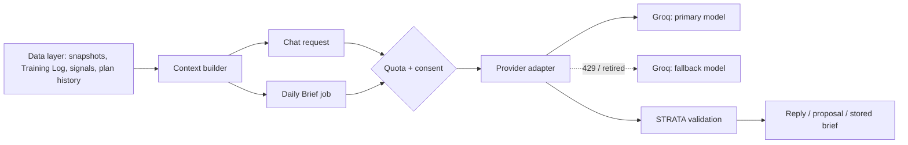

# Strata AI (Build 9)

Strata AI is STRATA's coach: an on-demand chat and a once-a-day **Daily Brief**. It runs on
**Groq**'s OpenAI-compatible API, server-side only, reads the member's facts from the shared data
layer (`DATA_MODEL.md`), and never changes anything without the member's tap.

## Architecture

| Piece | Module | Job |
|---|---|---|
| Provider adapter | `src/ai-provider.js` | `complete({messages, responseFormat, reasoningEffort})` against any OpenAI-compatible API; Groq is the default. Strict JSON-schema structured outputs, primary → fallback model on `429`/`404`/`503`, `retry-after` respected per model, token usage returned. Swapping providers is configuration (`STRATA_AI_BASE_URL`), not code. |
| Quota manager | `src/ai-quota.js` | One budget for the whole organization, persisted in `ai_usage_days`: a reserved share for Daily Briefs, a per-minute cap, and a per-member chat allowance. |
| Context builder | `src/ai-context.js` | Compact lines from Daily Snapshots, the Training Log, Rankings Signals, plan history, and today's brief, plus deterministic care flags. |
| Chat | `src/ai.js`, `src/ai-core.js` | Queue, prompt rules, proposal validation, nutrition previews computed by STRATA. |
| Daily Brief | `src/ai-daily-brief.js` | Schema, validation, and the throttled morning job. |
| Consent and settings | `src/ai-settings.js` | Consent, the Daily Brief choice, deleting stored notes, and the owner's usage view. |



## Models

Set by environment, never hard-coded: `STRATA_AI_MODEL` (primary) and `STRATA_AI_FALLBACK_MODEL`.
The Build 9 plan names `openai/gpt-oss-120b` and `openai/gpt-oss-20b`. **Before deploying, call
`GET https://api.groq.com/openai/v1/models` with the key and check Groq's deprecation page**; the
server logs `ai.models` with `primaryListed` and `fallbackListed` at startup. If a model is
retired, choose the closest production model that supports strict JSON-schema structured outputs.
(Groq's API and docs could not be reached from the build environment, so this check is part of
the deployment steps in `docs/deployment.md`.)

## Context sent to the model

Only what the answer needs, as compact text. Never the member's name, email, account ID, payment
details, or Polar tokens.

| Context | From | Size |
|---|---|---|
| Rules (voice, safety, output format) | `ai-core.js` `RULES` / `ai-daily-brief.js` `BRIEF_RULES` | ~1,500 chars chat, ~700 brief |
| Member summary: training setup, saved week, recent workouts, nutrition averages | `memberContext` | ~1,500 chars |
| Recent days (7 lines): sleep, recovery, HRV, resting HR, training done or planned, calories | Daily Snapshots | ≤ 2,400 chars with the items below |
| This week's sessions, most-trained exercises (8 weeks), how the saved week was made, today's brief | Training Log, Rankings Signals, `plan_changes` | included above |
| Care notes | `careFlags` | only when a flag fires |
| Exercise shortlist (chat) | `ai-catalog.js` | trimmed to fit |
| Conversation history (chat) | the page | last 6 turns, trimmed to fit |

**Token budget per call:** chat prompts are capped at 16,000 characters (about 4,000 tokens)
with up to 1,100 output tokens; a Daily Brief prompt is about 3,500 characters (about 900
tokens) with up to 600 output tokens and `reasoning_effort: "low"`.

## Structured outputs

Every non-chat task uses `response_format: {type: "json_schema", json_schema: {strict: true}}`.
If a provider rejects a strict schema, the adapter falls back to JSON mode, then plain text, and
remembers what each model accepts; STRATA validates every answer itself either way.

**Chat** (`src/ai-response-schema.js`): `{reply, week|null, nutrition|null, suggestions[], search[]}`.
Weeks may only use exercise codes from the shortlist; nutrition changes are recalculated by
STRATA's own energy model; nothing is saved until the member applies it.

**Daily Brief** (`briefSchema()`):

```json
{
  "readiness": {"level": "ready | steady | take_it_easy | unknown", "summary": "string"},
  "recommendation": {"title": "string", "detail": "string"},
  "planAdjustments": [{"day": "Monday…Sunday", "change": "string", "reason": "string"}],
  "insight": "string",
  "careNote": "string | null"
}
```

`validateBrief` trims every field (summary 240, title 80, detail 320, adjustments ≤ 2, insight
240), drops a care note STRATA did not flag, and supplies a gentle one when a flag fired but the
model left it out. An unreadable answer gets one retry; a second failure backs that member off
for an hour (three failures end the day) instead of retrying every minute.

## Daily Brief

- **When:** from 05:00 in the member's time zone (`STRATA_AI_BRIEF_HOUR`), and for Polar members
  after last night has synced or by 10:00 at the latest. A few members per minute, so the night's
  work is spread out rather than one burst. A member whose snapshot just changed goes first.
- **Who:** Strata+ members who allowed Strata AI and left the Daily Brief on.
- **Where it lives:** on that day's Daily Snapshot (`daily_snapshots.brief_json`), shown on the
  Overview and included in chat context, so no screen calls the model again. Cached by
  (member, date, task): one brief per day.
- **What it explains:** the facts STRATA already computed (recovery and stress against the
  member's usual nights, planned versus done, the training block, calorie targets). The
  deterministic explanations stay on their screens for members who don't use AI.

## Quota and free-tier limits

Groq's free tier limits the organization per model (roughly 30 requests a minute and 1,000 a
day per chat model; check the current numbers in the Groq console).

| Setting | Default | Meaning |
|---|---|---|
| `STRATA_AI_DAILY_REQUESTS` | 900 | Requests per UTC day for everyone together |
| `STRATA_AI_BRIEF_SHARE` | 0.4 | Share of the day kept for Daily Briefs; chat stops at the rest |
| `STRATA_AI_REQUESTS_PER_MINUTE` | 25 | Burst cap below the provider's per-minute limit |
| `STRATA_AI_USER_DAILY_LIMIT` | 30 | Chat requests per member per UTC day |

When chat's share is spent, `/ai` shows "Strata AI is resting for today" and the cached Daily
Brief stays on the Overview. Requests that fail before the model does any work are refunded.
Switching to Groq's paid tier is configuration only: raise these numbers.

## Cost estimate

Free tier: **$0**, within the limits above. At 900 requests a day, about 360 Daily Briefs and
540 chat requests fit.

Paid tier, per active member per month, at **$0.15 per million input and $0.75 per million
output tokens** (verify current Groq pricing for the chosen model):

| Use | Tokens per month | Cost |
|---|---|---|
| Daily Brief, every day | ~30 × (900 in + 400 out) = 27k in, 12k out | ≈ $0.013 |
| Chat, 3 requests a day | ~90 × (4,000 in + 600 out) = 360k in, 54k out | ≈ $0.095 |
| **Total** | | **≈ $0.11** |

The owner sees today's chat requests, Daily Briefs, tokens, and requests left on the admin
Overview; `GET /api/ai/usage` also lists the heaviest members.

## Safety

- The rules forbid diagnosis, treating pain or injury, and advice on pregnancy, medication, or
  eating disorders; the chat suggests a qualified professional instead.
- **Care flags** are computed by STRATA, not the model: resting heart rate more than 7 bpm above
  the member's own usual for 3 days, overnight stress signals above usual for 3 nights, or sleep
  under 5 hours for 3 nights. When one fires, the brief carries a gentle "consider checking in
  with a health professional" note. One bad night never triggers it.
- Proposals (weeks, swaps, nutrition) are validated against the catalog and STRATA's models and
  change nothing until the member applies them; accepted weeks are tagged `ai` in plan history.

## Privacy

- **Consent first:** nothing is sent to the provider until the member taps "Allow and share with Groq", which names Groq and what is sent (App Store Guideline 5.1.2(i))
  (`PUT /api/ai/settings`). Withdrawing stops all sending at once; the Daily Brief can be turned
  off separately.
- **Minimum data:** only the compact summary above; no identifiers.
- **Zero Data Retention:** turn it on in the Groq console's Data Controls before launch; the
  privacy policy (section 8) says STRATA's account uses it.
- **Members' control:** stored briefs and usage counts are in the account export, deleted with
  the account, and briefs can be deleted any time from `/ai` (`DELETE /api/ai/notes`).
- Logs record request kind, outcome code, duration, and token counts, never messages or answers.

## Routes

| Route | Who | Purpose |
|---|---|---|
| `GET /api/ai/status` | Strata+ | Online state, consent, Daily Brief choice, remaining requests, resting |
| `POST /api/ai/requests`, `GET /api/ai/requests/:id` | Strata+ with consent | Queue a chat or suggestions request and poll it |
| `GET`/`PUT /api/ai/settings` | Any signed-in member | Read or change consent and the Daily Brief |
| `DELETE /api/ai/notes` | Any signed-in member | Delete stored Daily Briefs |
| `GET /api/ai/usage` | Owner | Today's requests and tokens (shown on the admin Overview) |
| `GET /api/snapshots` | Strata+ | Daily Snapshots, including the stored brief |
